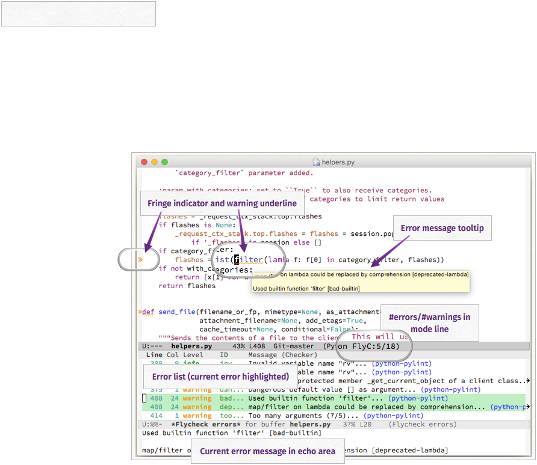

# Flycheck <small>Syntax checking for GNU Emacs</small> #

**Flycheck** is a modern on-the-fly syntax checking extension for GNU Emacs,
intended as replacement for the older Flymake extension which is part of GNU
Emacs.

It uses various syntax checking and linting tools to
[automatically check the contents of buffers][checking] while you type, and
reports warnings and errors directly in the buffer, or in an optional error
list:

Out of the box Flycheck supports over
[40 different programming languages][languages] with more than 80 different
syntax checking tools, and comes with a [simple interface][definitions] to
define new syntax checkers.

Many [3rd party extensions]({{site.baseurl}}/extensions.html) provide new syntax
checkers and other features like alternative error displays or mode line
indicators.

[checking]: {{site.baseurl}}/manual/latest/Checking-buffers.html#Checking-buffers
[languages]: {{site.baseurl}}/manual/latest/Supported-languages.html#Supported-languages
[definitions]: {{site.baseurl}}/manual/latest/Defining-syntax-checkers.html#Defining-syntax-checkers

## Very quick start ##

Flycheck needs GNU Emacs 24.1 or newer, and works best on Unix systems.
**Windows users**, please be aware that Flycheck does not support Windows
officially, although it should mostly work fine on Windows.  See
[Windows support][] and watch out for [known Windows issues][windows issues]!

Install some [syntax checker tools][languages] and type the following in your
`*scratch*` buffer and run `M-x eval-buffer`:

    (require 'package)
    (add-to-list 'package-archives
                 '("melpa" . "http://stable.melpa.org/packages/") t)
    (package-initialize)

    (package-install 'flycheck)

    (global-flycheck-mode)

For a more gentle introduction read the [Installation][] instructions and go
through [Quickstart][] guide.

[Windows support]: {{site.baseurl}}/manual/latest/Installation.html#index-Windows
[windows issues]: https://github.com/flycheck/flycheck/labels/B-Windows%20only
[Installation]: {{site.baseurl}}/manual/latest/Installation.html#Installation
[Quickstart]: {{site.baseurl}}/manual/latest/Quickstart.html#Quickstart

## Latest news ##

These are the latest news about Flycheck and it’s community:

<dl>

<dt>{{ post.date | date_to_string }}</dt>
<dd><a href="{{site.baseurl}}{{post.url}}">{{ post.title | escape }}</a></dd>

</dl>

